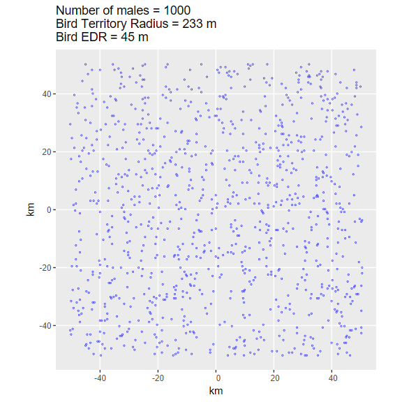
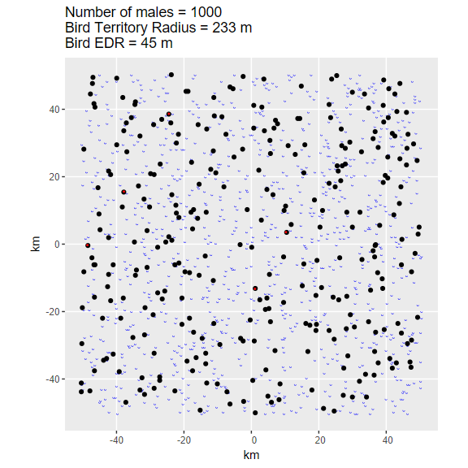

# Motivation

The goal of this study is to evaluate the sample size requirements to
estimate population sizes of Gray-headed Chickadee in Alaska.

# Simulation description

These simulations place home ranges on a hypothetical landscape, and
conduct simple random sampling across that landscape to estimate the
expected number of detections that would occur under various
population/sampling scenarios.

The simulated data are then analyzed with a Bayesian model to produce
estimates of population size, which can then be compared to the ‘true’
(i.e., simulated) numbers of birds. These estimates of population size
are then used to conduct precision and power analyses.

### Simulation assumptions

1.  bird territories are distributed randomly across available habitat
2.  bird territory boundaries do not overlap
3.  the area of potentially suitable GHCH habitat in AK is 10117
    km<sup>2</sup> (estimated based on remote sensing)
4.  surveys are positioned independently of bird occurrence
5.  surveys are not clustered

### Example of simulated landscape and survey

We assume in this example that there are 1000 GHCH pairs distributed
across the landscape, such that density is 0.099 birds/km<sup>2</sup>.
Later, we will conduct a full suite of simulations across multiple
hypothetical GHCH population sizes.

The plot below illustrates the spatial distribution of GHCH territories
for one realization of the simulation.



Next, we position a number of ARUs on the landscape.



In this example we positioned 300 ARUs, and obtained 5 detections of
GHCH.

# Statistical analysis

We analyze the resultant data (5 detections across 300 ARUs) using a
Bayesian model. The model assumes that we know the effective detection
radius for Gray-headed Chickadee that are surveyed by ARUs. The model
further assumes that since ARUs are positioned and continuously
monitoring for the entire breeding season, if the effective detection
radius overlaps a GHCH territory it will detect the species at least
once over the course of a season.

The analysis is coded in the JAGS language:

``` r

    model {

      # Moderately informative prior on density (assume it is low, but with enough uncertainty to capture higher densities)
      dens_prior_median <- 0.2
      dens_prior_sd <- 2
      
      dens ~ dlnorm(log(dens_prior_median),pow(dens_prior_sd,-2))
      popsize <- IAO_area * dens
      
      total_area_detectable <- popsize * pi * (territory_radius + EDR)^2
      proportion_detectable <- total_area_detectable/IAO_area
      
      # Likelihood
      y ~ dbin(proportion_detectable, n_ARU)
      
      # Output the priors to evaluate if they look reasonable
      dens_prior ~ dlnorm(log(dens_prior_median),pow(dens_prior_sd,-2))
      popsize_prior <- IAO_area * dens_prior
    }
    
```

In this code, we specific a relatively uninformative prior for density,
and must supply as data the area of potentially suitable habitat
(IAO_area = 10117 km<sup>2</sup>), number of ARUs we positioned in
potentially suitable habitat (n_ARU = 300), and the number of ARUs that
detected the species (y = 5) after being deployed for the entire season.

In brief, the model attempts to estimate the range of population sizes
(and population densities) that would be consistent with the observed
number of detections, given the amount of survey effort that was
conducted.

``` r

    # Analyze using JAGS
  jags.data <- list(y = n_ARU_det,   # Number of ARUs that detected the species
                    n_ARU = n_ARU,
                    IAO_area = plot_area,
                    territory_radius = bird_Tr,
                    EDR = bird_EDR,
                    pi = pi)
  
  out <- jags(data = jags.data,
              model.file = "ghch_model.jags",
              parameters.to.save = c("dens","popsize","popsize_prior","dens_prior"),n.chains = 3,
              n.thin = 1,
              n.iter = 6000,
              n.burnin = 1000,
              verbose = FALSE)
    
```

In this case, the estimate of population size is: 685 with 95%
equal-tailed credible interval of 257 to 1462.

Application of the statistical model to

# Simulation results
